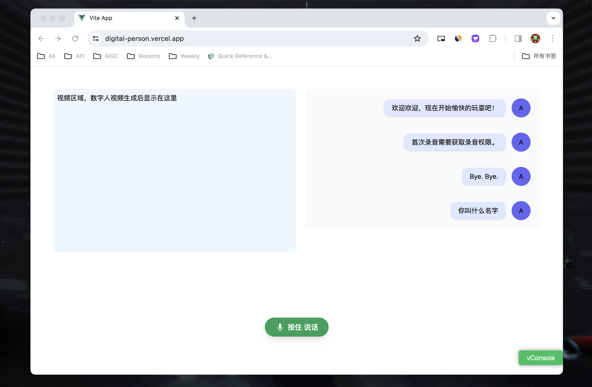

# 介绍
仓促之下随心而写，代码较为混乱，并没有对接数字人接口。为方便起见，接口皆为国内代理。

> 此DEMO演示步骤：语音录制 -> 音频转文本 -> GPT回复 -> 回复文本转音频 -> 数字人生成
> 最后一步并未做实际实现，如果你想要对接最后的接口可以去看这篇文章：[SadTalker API](https://sadtalkerai.com/sadtalker-ai-api/)



# 如何运行？
```bash
bun install
bun run dev
```

# Vercel云托管
https://digital-person.vercel.app/
